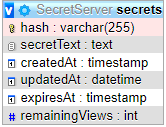

# Secret-server
Secret server API task for job applicant

Usesd Technologies:

Language:  Node.js

Framework: Express

Database:  Sequelize (MySQL)

Api Test:  Postman (find the collection file in the repo)

Host:      Own UbuntuVM/Apache/2.4.41

Web app available at : http://63.250.59.101:443/

This repository hosts the code for a Secret Server API, designed to securely store secrets with optional access restrictions based on views or expiration time. 
Functionality
The Secret Server API allows users to:

-Add Secrets: Users can save secrets by providing the text and optionally setting restrictions such as maximum views or an expiration time.
-Retrieve Secrets: Secrets can be retrieved using a unique hash identifier generated during creation. Access is restricted based on the specified parameters (views or time).

Currently, the application does not encrypt stored text because it was not a requirement based on the specifications. This means that while encryption could enhance security, the current implementation does not include this feature

DB modell:

Thank you for reading if u have any question please feel free to contact me : pappzoltan6969@gmail.com